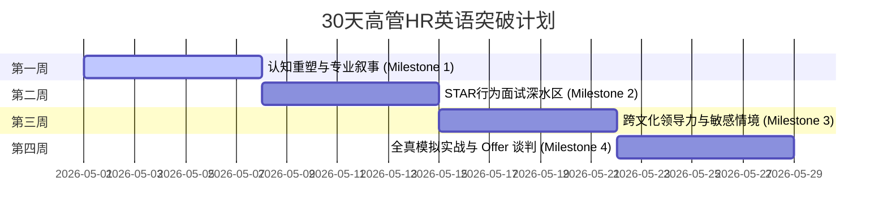

# 30天高管级 HR 英语突破计划 (30-Day Executive HR English Training Program)

> **"Speak with Executive Presence, Lead with Strategic Depth."**
> 专为拥有 15+ 年深厚行业积淀、旨在突破外企或中资出海企业 **HRD / HRBP Leader** 面试的资深 HR 经理打造的 30 天高效英语突破与实战打卡项目。

---

## 🎯 项目愿景与设计理念

在高级人力资源管理岗位（HRD/HRBP Leader）的英文面试中，面试官评估的并非考生的“托福雅思分数”，而是其**战略思考高度、商业洞察力以及跨文化领导力**。

本项目的核心设计逻辑是 **“专业度重塑 (Strategic Competence Reframing)”**：
1. **避开传统语法的死记硬背**：不从零纠结细微的语法对错，而是直接训练用高管级别的结构和词汇来表达深度的商业成果。
2. **专业积淀转化为语言优势**：将 15 年的组织发展 (OD)、员工关系 (ER)、薪酬绩效、人才盘点等专业履历，精准映射为地道、干练的英文高管话术。
3. **基于 GitHub Issue 的互动式打卡 (Interactive LMS)**：每一个 Issue 都是一个真实的面试模块或日常实战场景，你可以通过提交评论进行文稿打卡或语音链接提交，获得系统化的润色与反馈。

---

## 🗓 30天成长路线图 (30-Day Roadmap)

项目分为 4 个核心里程碑 (Milestones)，每周一个主题，循序渐进：

### 🏆 Milestone 1: 认知重塑与 HR 专业叙事 (Week 1)
* **核心任务**：克服“完美主义”焦虑，重塑英文沟通的配得感；打造极具说服力的 3 分钟黄金自我介绍 (Elevator Pitch)；掌握现代战略级 HR 的高频商业词汇。
* **相关文档**：[`docs/week1_confidence_pitch.md`](docs/week1_confidence_pitch.md)
* **包含任务 (Issues)**：
  - **Issue #1**: 认知重塑：克服口语焦虑与重建高管英文气场
  - **Issue #2**: 黄金自我介绍：打磨你的 3 分钟 HRD / HRBP Leader 专属 Elevator Pitch
  - **Issue #3**: 战略 HR 核心英语词汇与高管级发音练习

### 🏆 Milestone 2: STAR 深度行为面试实战 (Week 2)
* **核心任务**：精通高管级 STAR 故事线，用清晰的英文结构和精准的量化数据展示在组织发展 (OD)、员工关系 (ER) 及人才管理三大核心战役中的重大成果。
* **相关文档**：[`docs/week2_behavioral_star.md`](docs/week2_behavioral_star.md)
* **包含任务 (Issues)**：
  - **Issue #4**: STAR 战役一：组织发展 (OD) 与架构变革的英文叙事
  - **Issue #5**: STAR 战役二：危机处理与重难点员工关系 (ER) 英文谈判
  - **Issue #6**: STAR 战役三：人才盘点、继任者计划与绩效变革英文呈现

### 🏆 Milestone 3: 跨文化沟通与全球领导力 (Week 3)
* **核心任务**：掌握如何向全球总部 (HQ) 或外籍高管进行坚定且专业的向上管理与对齐；攻克出海建点合规话术；巧妙且战略化地阐述“待业空白期”与“跳槽动机”。
* **相关文档**：[`docs/week3_global_leadership.md`](docs/week3_global_leadership.md)
* **包含任务 (Issues)**：
  - **Issue #7**: 向上管理与总部对接：跨文化英文影响力与坚定的 Pushback 艺术
  - **Issue #8**: 中资出海与全球化挑战：海外建点招聘合规与多元文化融合
  - **Issue #9**: 敏感情境应对：如何战略性地转化“待业空白期”与“跳槽动机”

### 🏆 Milestone 4: 压力面试模拟与战略宣讲 (Week 4)
* **核心任务**：撰写展示即战力的英文 30-60-90 天工作规划；设计向业务线/ CEO 提问的高价值反问问题；熟练掌握英文薪酬谈判与 Offer 最终对齐。
* **相关文档**：[`docs/week4_mock_stress.md`](docs/week4_mock_stress.md)
* **包含任务 (Issues)**：
  - **Issue #10**: 战略入职规划：撰写英文 30-60-90 天工作计划大纲
  - **Issue #11**: 逆向掌控：如何在面试尾声向业务/CEO提出高水准的反问
  - **Issue #12**: 极限压力面试模拟与英文薪酬谈判话术实战

---

## 🤖 Google AI 学习工具快速入口

本课程深度整合三大 Google AI 工具，帮助你把学习效率提升 3 倍。详细操作指南请参阅：[**📖 AI 工具综合使用手册 →**](docs/ai_tools_guide.md)

| 工具 | 功能定位 | 直达链接 |
|---|---|---|
| 🔬 **Google Tiny Lesson** | 输入 HR 面试场景，即时生成词汇 + 语法 + 发音 | [立即使用 →](https://labs.google/lll/en/experiments/tiny-lesson) |
| 📔 **Google NotebookLM** | 上传教材，一键生成通勤播客 + 智能闪卡 + 自测题 | [立即使用 →](https://notebooklm.google.com/) |
| 🎬 **YouTube Shadowing** | 跟读顶尖 Executive Coach，复刻高管气场与语调节奏 | 搜索词见各周 `docs/week*.md` |

> 💡 **推荐每日组合**：早晨通勤听 NotebookLM 播客（10-20 分钟）→ 白天用 Tiny Lesson 热身词汇（5 分钟）→ 每周 2-3 次 YouTube Shadowing 跟读（30 分钟）

---

本项目不仅是教材，更是你**个人的英文面试作品集 (Portfolio) 与打卡看板**。

1. **查看任务**：在 GitHub 的 **Issues** 面板中，你可以看到 12 个待办任务。它们已与各周的 **Milestone** 关联。
2. **深入学习**：点击每个 Issue 中的说明，或直接进入 `docs/` 目录阅读对应章节的精讲方法与英文模版。
3. **提交打卡 (Homework)**：
   - 在对应的 Issue 下方点击 **Comment**。
   - 输入你根据模版撰写好的 3 分钟自我介绍、STAR 故事或 30-60-90 天计划草稿。
   - 如果进行了口语练习，你可以将录音文件上传至网盘（或使用如 Vocaroo 等免注册录音工具生成链接），贴在 Comment 里。
4. **获取反馈与重构**：
   - 你的专属 AI 导师会直接在 Issue 的评论区为你进行**逐句润色 (Copyediting)**，将普通的英文表达升级为更具战略感、说服力的外企高管风范。
   - 每次完成任务后，可以关闭 (Close) 对应的 Issue，实时在 Milestone 进度条中看到自己的成长！

---

## 🕯 导师寄语 (Mentor's Message)

> *"Your 15 years of HR experience is not a gap; it is your ultimate leverage. English is simply the bridge to convey your wisdom. Do not let fear hold you back. Let's make your voice heard."*
> 
> 语言只是一种工具，你的 15 年资深 HR 管理经验、精湛的组织洞察力和商业判断，才是面试官梦寐以求的核心价值。让我们共同开启这 30 天的蜕变之旅！
